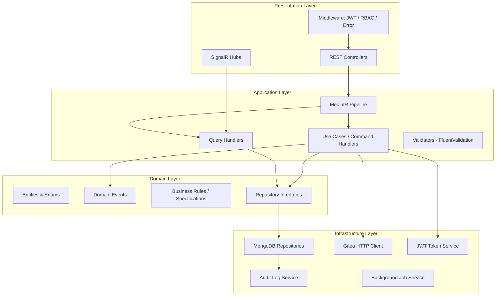
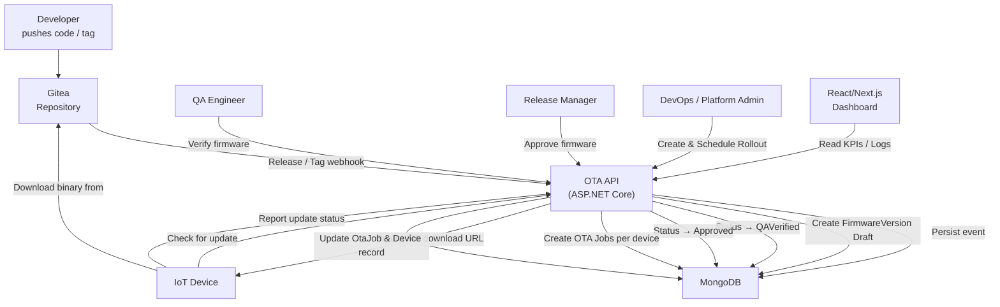
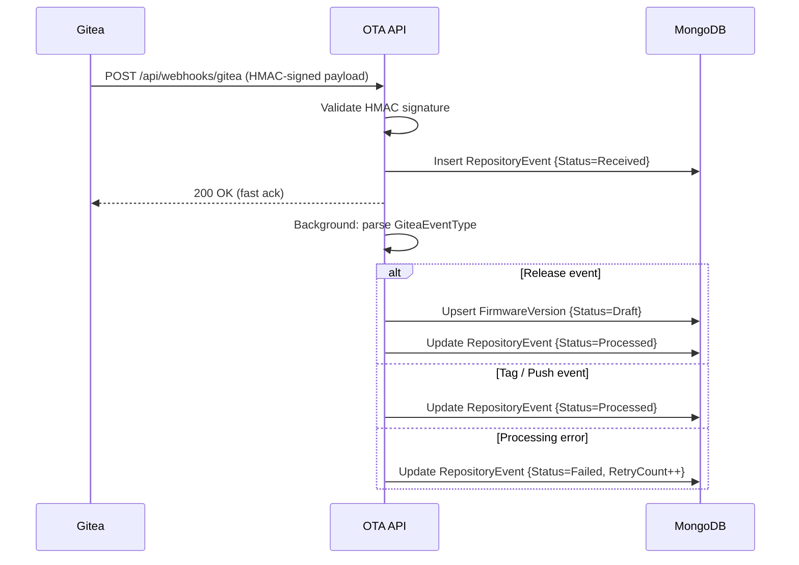
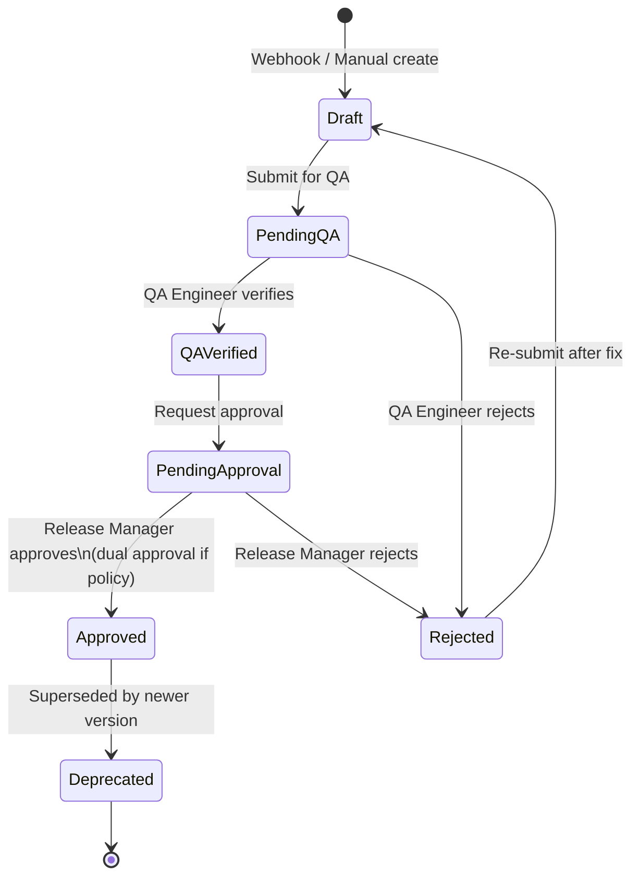
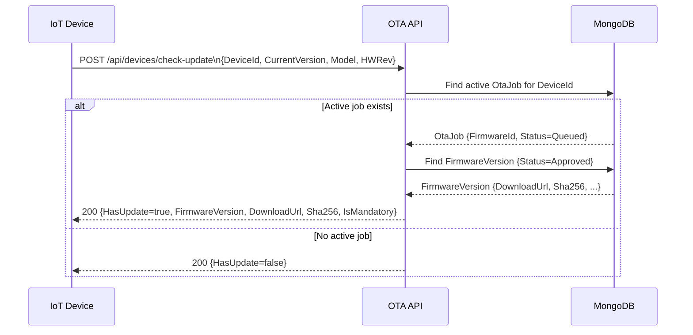
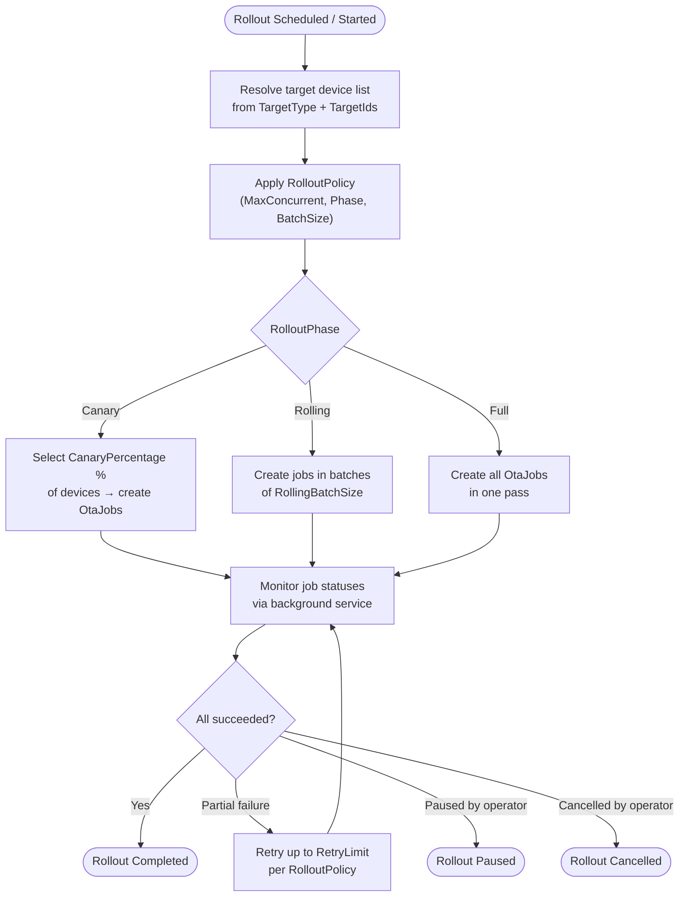
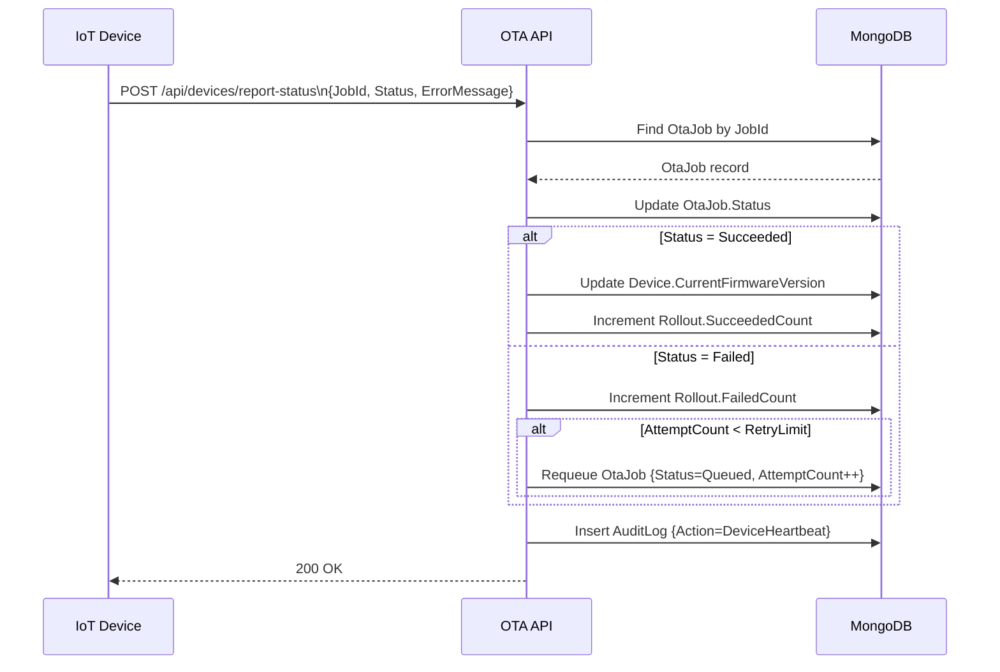
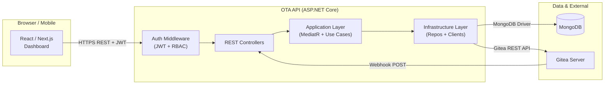
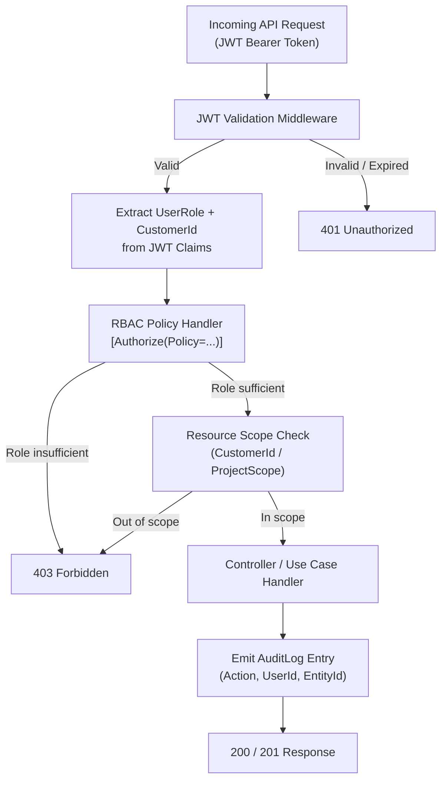

# OTA Platform — Enterprise Architecture Document

## 1. System Overview

The OTA (Over-The-Air) Firmware Update Platform is an enterprise-grade, cloud-native solution designed to manage the full lifecycle of firmware releases across tens of thousands of IoT/embedded devices. The platform integrates with Gitea as its source of truth for firmware binary artefacts and release metadata, exposing a RESTful ASP.NET Core API as its central orchestration layer. All persistent state—user identities, device registries, firmware catalogue, rollout schedules, audit trails, and webhook events—is stored in MongoDB. A React/Next.js single-page application provides a role-aware dashboard for platform operators, release managers, QA engineers, and customer administrators. The system enforces a strict approval workflow (QA verification → dual approval) before any firmware build may be deployed to production devices, and it provides granular, role-based access control (RBAC) across every API surface and UI screen.

---

## 2. Component Responsibilities

### 2.1 Gitea (Self-Hosted Git & Release Server)
- Hosts all firmware source repositories organised under Gitea organisations (one per customer/project).
- Produces Release artefacts (binary `.bin`/`.tar.gz` files) tagged with semantic versions.
- Fires webhook events (Push, Tag, Release, Create, Delete) to the OTA API on repository activity.
- Acts as the canonical download source for firmware binaries; devices receive pre-signed or proxied Gitea asset URLs.

### 2.2 ASP.NET Core API (OTA.API)
- Implements Clean Architecture with Domain, Application, Infrastructure, and Presentation layers.
- Orchestrates the firmware approval workflow: Draft → PendingQA → QAVerified → PendingApproval → Approved/Rejected.
- Manages rollout scheduling, device targeting, batch execution (canary / rolling / full), and real-time status aggregation.
- Consumes Gitea webhooks and reconciles release metadata into the firmware catalogue.
- Enforces JWT-based authentication and RBAC policy on every endpoint.
- Persists all state to MongoDB via the Repository pattern.
- Emits structured audit log entries for every mutating operation.

### 2.3 MongoDB (Primary Data Store)
- Stores all platform entities: Users, Projects, Repositories, FirmwareVersions, Devices, OtaJobs, Rollouts, RolloutPolicies, RepositoryEvents (webhook), and AuditLogs.
- Provides compound indexes for high-throughput device check-update queries (DeviceId + FirmwareVersion + Status).
- Supports aggregation pipelines for dashboard KPIs and trend reports.
- Collections are logically namespaced per customer (`CustomerId`) to support multi-tenancy.

### 2.4 React / Next.js Frontend
- Server-side rendered (SSR) dashboard for fast initial load and SEO-safe public pages.
- Role-aware UI: menu items, action buttons, and data columns are conditionally rendered per the caller's `UserRole`.
- Integrates with the OTA API using typed Axios/fetch clients generated from OpenAPI specifications.
- Provides real-time rollout progress via WebSocket or polling.
- Supports dark mode, accessibility (WCAG 2.1 AA), and responsive layout for operations centres.

---

## 3. Clean Architecture Layer Diagram

---

## 4. Mermaid Diagrams

### 4a. Overall OTA Platform Workflow

### 4b. Gitea Webhook Flow

### 4c. Firmware Approval Flow

### 4d. Device Check-Update Flow

### 4e. Rollout Execution Flow

### 4f. Device Report-Status Flow

### 4g. Frontend–Backend–Gitea–MongoDB Architecture

### 4h. Role-Based Access Flow

---

## 5. Technology Stack Summary

| Layer | Technology |
|---|---|
| Frontend | React 18, Next.js 14 (App Router), TypeScript, Tailwind CSS |
| API | ASP.NET Core 8, MediatR, FluentValidation, AutoMapper |
| Auth | JWT Bearer, Refresh Tokens, BCrypt password hashing |
| Database | MongoDB 7 (replica set), MongoDB .NET Driver 3 |
| Source Control | Gitea (self-hosted) |
| Containerisation | Docker, Docker Compose |
| Reverse Proxy | NGINX |
| CI/CD | Gitea Actions / GitHub Actions |
| Monitoring | Seq (structured logging), Prometheus + Grafana |

---

## 6. Security Considerations

- All inter-service communication uses TLS 1.3.
- Gitea webhook payloads are HMAC-SHA256 validated before processing.
- Firmware binary integrity is enforced via SHA-256 checksum comparison on device.
- JWT tokens have short expiry (15 min); refresh tokens are rotated on each use and stored hashed in MongoDB.
- MongoDB collections are access-controlled via dedicated service accounts; no direct internet access.
- All mutating operations produce immutable audit log entries with IP address and user agent.
- Dual-approval policy is enforced at the application layer for production firmware promotion.
